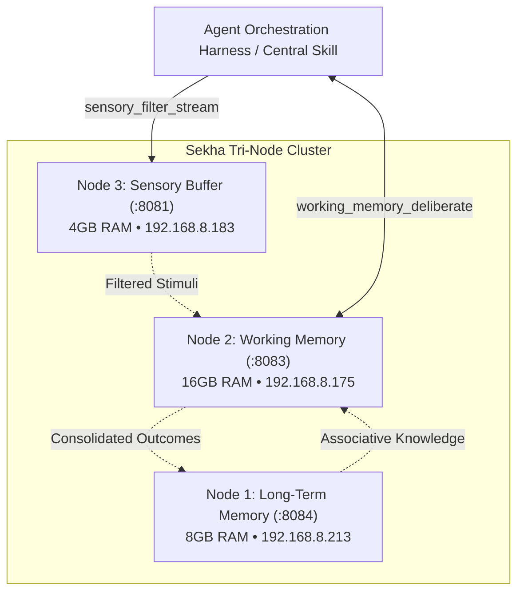

# 🧠 Sekha Working Memory Deliberation Scratchpad

[](LICENSE)
[-orange.svg)]()
[]()
[]()

The **Working Memory Deliberation Scratchpad** is the active cognitive scratchpad service running on **Node 2** (`sekha-node2` &bull; `192.168.8.175` &bull; 16GB RAM) of the **Sekha Tri-Node Edge Cognitive Cluster**.

It emulates human working memory (inspired by Baddeley's model of the central executive and episodic buffer) by maintaining intermediate hypotheses, multi-step chain-of-thought trajectories, and uncommitted candidate actions in volatile local RAM **without prematurely polluting permanent storage**.

---

## 🏛️ Place in the Tripartite Cognitive Cluster



---

## ✨ Key Features

1. **Working Memory State Schema**:
   - **Active Goal**: Primary objective currently being evaluated.
   - **Sensory Chunks**: High-salience text events ingested from Node 3's ring buffer (`:8081`).
   - **Long-Term Context**: Associative knowledge recalled from Node 1 (`:8084`).
   - **Reasoning Trajectory**: Step-by-step internal monologue (`Thought`) and proposed actions (`Action`).
   - **Candidate Actions**: Uncommitted decisions held until deliberation concludes.

2. **In-Memory Store & Snapshot Isolation**:
   - Operates entirely within Node 2's local RAM envelope (~14 GiB free headroom).
   - Fast state snapshots before every deliberation step.
   - **Instant Rollback**: If an intermediate hypothesis or tool proposal fails or is deemed unsafe, the scratchpad rolls back to an earlier snapshot, completely isolating errors and preventing permanent state pollution.

3. **Dynamic Context Budgeter**:
   - Manages strict token allocation (e.g. 2,048 tokens total context with 256 tokens output reserve).
   - Prevents prompt truncation while ensuring system instructions and goals are preserved:
     - System prompt & schema: ~320 tokens (fixed, immutable)
     - Active goal: ~150 tokens
     - Sensory context: ~400 tokens (highest salience first)
     - Long-term context: ~350 tokens
     - Trajectory history: ~572 tokens (rolling window of recent steps)
     - Generation reserve: 256 tokens

4. **Native Local Inference Integration**:
   - Communicates over localhost with Node 2's natively compiled `llama-server` on port `8082` (`Qwen2.5-1.5B-Instruct` on ARM NEON).
   - Parses structured thoughts, discrete actions, and completion flags.

---

## 📡 REST API Reference (Port `8083`)

### 1. `POST /api/v1/working/deliberate`
Ingests an objective, sensory stimuli, or observation from an action, updates the scratchpad, calls the local SLM, and returns the next-step plan.

**Request:**
```json
{
  "objective": "Diagnose inter-node packet loss between Node 3 and Node 2",
  "sensory_chunks": [
    {
      "id": "chunk-101",
      "text": "Ring buffer reported 2 dropped frames during 5000 req/s burst",
      "salience": 0.89,
      "source": "sekha-node3"
    }
  ],
  "long_term_context": [
    "Switch port 2 links to Node 3; full duplex flow control enabled"
  ],
  "observation": "Previous ping to 192.168.8.183 succeeded with 0.28ms latency",
  "max_tokens": 256,
  "temperature": 0.2
}
```

**Response:**
```json
{
  "status": "ok",
  "step_index": 2,
  "thought": "Ping latency is optimal at 0.28ms, indicating physical link carrier is healthy. The reported drops were likely transient ICMP rate limits.",
  "proposed_action": "Query Node 3 sensory buffer stats endpoint for dropped count",
  "is_complete": false,
  "prompt_tokens": 142,
  "completion_tokens": 36,
  "total_tokens": 178,
  "prompt_eval_rate_tps": 32.15,
  "generation_rate_tps": 12.44,
  "active_goal": "Diagnose inter-node packet loss between Node 3 and Node 2",
  "trajectory_length": 2,
  "timestamp": "2026-09-13T18:30:00Z"
}
```

---

### 2. `GET /api/v1/working/scratchpad`
Returns the full active working memory state for cluster harness inspection and debugging.

**Response:**
```json
{
  "session_id": "wm-a4f7819c4d2e",
  "active_goal": "Diagnose inter-node packet loss between Node 3 and Node 2",
  "sensory_context": [...],
  "long_term_context": [...],
  "trajectory": [
    {
      "step_index": 1,
      "thought": "Initial assessment of network state",
      "action": "ping Node 3",
      "observation": "0.28ms RTT",
      "status": "success",
      "timestamp": "2026-09-13T18:29:45Z"
    }
  ],
  "candidate_actions": [],
  "status": "deliberating",
  "token_estimate": 178,
  "created_at": "2026-09-13T18:29:30Z",
  "updated_at": "2026-09-13T18:30:00Z"
}
```

---

### 3. `POST /api/v1/working/rollback`
Restores working memory to a previous snapshot, discarding faulty or unsafe intermediate reasoning steps without polluting state.

**Query Parameters:**
* `snapshot_id`: (Optional) ID of snapshot to restore. If omitted, reverts to most recent snapshot.

**Response:**
```json
{
  "status": "rolled_back",
  "message": "working memory restored to snapshot",
  "state": { ... }
}
```

---

### 4. `POST /api/v1/working/clear`
Flushes the active scratchpad and all snapshots upon task completion.

---

### 5. `GET /api/v1/working/health` (or `/healthz`)
Reports daemon status and validates local downstream reachability to `llama-server` on port `8082`.

---

## 🛠️ Build & Installation

### Local Compilation
```bash
make build
```

### Cross-Compile for ARM64 (Raspberry Pi 5)
```bash
make build-arm64
```

### Run Synthetic Validation Suite
```bash
make validate
```

### Deployment on Node 2
1. Pull latest code to Node 2:
   ```bash
   git pull origin main
   ```
2. Build and install systemd unit:
   ```bash
   make install
   ```
3. Check status via the native Node 2 management CLI:
   ```bash
   sekha status
   ```
   Or query the scratchpad service directly:
   ```bash
   curl http://localhost:8083/api/v1/working/health
   ```

---

## 📄 License
Licensed under the Apache License, Version 2.0. See [LICENSE](LICENSE) for details.
