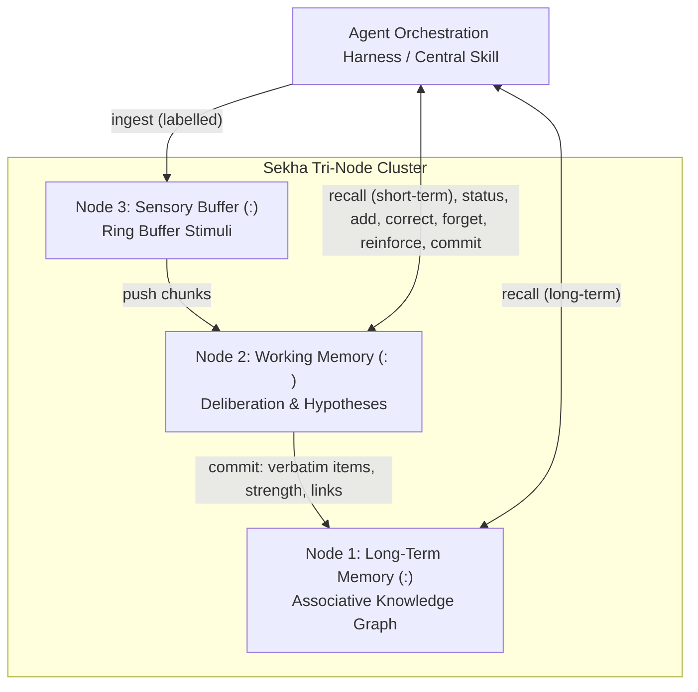

# 🧠 Sekha Working Memory Deliberation Scratchpad

[](LICENSE)
[]()
[]()

The **Working Memory Deliberation Scratchpad** is the active cognitive deliberation service for the **Sekha Tri-Node Edge Cognitive Cluster**.

It is the cluster's **working memory**: a RAM-only temp store where each memory (one Node 3 ingest, `memory_id`) waits between the sensory layer and long-term memory. There the model processes it one strong chunk at a time, and the harness can add to it, correct it, forget from it and reinforce it. Then it is committed to long-term memory and deleted **without anything unreviewed polluting permanent storage**.

Every model call is **stateless**: its prompt is built only from what that call selects (one chunk, its neighbours, related items of the same memory). State lives in the explicit, listable temp store, never in hidden prompt history. All host, port, model, and network parameters are configurable via environment files.

**Version:** 1.0.0

---

## 🏛️ Place in the Tripartite Cognitive Cluster


```mermaid
graph TD
    Harness[Agent Orchestration Harness / Central Skill]
    
    subgraph Cluster["Sekha Tri-Node Cluster"]
        Node3["Node 3: Sensory Buffer (:<port>)<br>Ring Buffer Stimuli"]
        Node2["Node 2: Working Memory (:<port> )<br>Deliberation & Hypotheses"]
        Node1["Node 1: Long-Term Memory (:<port>)<br>Associative Knowledge Graph"]
    end
    
    Harness -->|"ingest (labelled)"| Node3
    Node3 -->|"push chunks"| Node2
    Node2 -->|"commit: verbatim items, strength, links"| Node1
    Harness <-->|"recall (short-term), status, add, correct, forget, reinforce, commit"| Node2
    Harness <-->|"recall (long-term)"| Node1
```

---

## ⚙️ Configuration & Environment

The service requires explicit configuration without hardcoded fallback values. Configuration is loaded from:
1. **CLI Flags** (e.g. `-node-port`, `-model`, `-inference-url`, `-env`)
2. **Environment Variables** (`os.Environ`)
3. **Local `.env` file** (or path provided via `-env`)
4. **System-wide configuration** at `/etc/default/sekha` (auto-discovered if `.env` is absent)

If any required configuration key is missing, the service fails fast with an explicit error.

### Required Environment Keys

| Variable | Description | Example |
| :--- | :--- | :--- |
| `NODE_PORT` | HTTP port for the deliberation scratchpad service (alias: `PORT`) | `8083` |
| `NODE_NAME` | Node identifier for cluster topology reporting | `sekha-node2` |
| `INFERENCE_URL` | Base URL of OpenAI-compatible inference engine (alias: `LLAMA_URL`) | `http://127.0.0.1:8082` |
| `INFERENCE_MODEL` | Model identifier (alias: `LLAMA_MODEL`) | `qwen2.5-1.5b-instruct` |
| `INFERENCE_TIMEOUT_SEC`| Timeout for one deliberation (inference call) in seconds; a full 4,096 window | `60` |
| `CONTEXT_LIMIT` | Maximum token envelope for cognitive context | `2048` |
| `OUTPUT_RESERVE` | Reserved tokens for next-step generation | `256` |
| `SYSTEM_PROMPT` | *(Optional)* System prompt override for deliberation reasoning | *(Custom string)* |

### Optional Prompt Budget Keys

Each part is a cap, not a reservation: whatever a part leaves unused goes to the sensory chunks.
The prompt window is `CONTEXT_LIMIT - OUTPUT_RESERVE`; packing targets that minus `PROMPT_SAFETY_MARGIN`.

| Variable | Description | Default |
| :--- | :--- | :--- |
| `GOAL_BUDGET` | Cap on the objective text | `150` |
| `OBSERVATION_BUDGET` | Cap on the current observation | `572` |
| `LONG_TERM_BUDGET` | Cap on long-term facts (ignored for `prepacked` requests) | `350` |
| `SENSORY_BUDGET` | Cap on sensory chunks; `0` = rest of the window (ignored for `prepacked` requests) | `0` |
| `PROMPT_SAFETY_MARGIN` | Headroom for chat-template tokens and token-estimate error | `32` |

### Optional Working Memory Keys

| Variable | Description | Default |
| :--- | :--- | :--- |
| `WM_CALL_BUDGET` | Per-call prompt budget in tokens (system + user); related items count toward it | `1024` |
| `WM_WAIT_LIMIT_SEC` | Longest a strong chunk may wait in the queue; then it is marked `timed_out` and committed unprocessed. `0` = no limit | `600` |
| `WM_IDLE_TIMEOUT_SEC` | Idle time, with nothing queued or in flight, before a memory is committed | `60` |
| `WM_WORKERS` | Parallel model workers (1 on the Pi 5) | `1` |
| `WM_RELATED_ITEMS` | Related items from the same memory offered to one model call; `0` = none | `5` |
| `WM_MAX_ITEMS` | Items held in the temp DB across all memories; Node 3 pushes beyond this get `503` | `50000` |
| `WM_REINFORCE_STEP` | Strength added by one reinforcement | `0.1` |
| `WM_COMMIT_TIMEOUT_SEC` | Longest one commit may take | `30` |
| `WM_COMMIT_JOURNAL` | Interim commit target until Node 1's write endpoint (Task 31): one JSON line per committed memory. Without it, Node 3's pushes are refused (`503`) | *(empty)* |
| `WM_EMBED_URL` / `WM_EMBED_MODEL` | OpenAI-compatible `/v1/embeddings` server for scoring harness items and thoughts against the task, as Node 3 does (all-MiniLM-L6-v2); empty = stored unscored | *(empty)* |

### Example `.env`

Copy `.env.example` to `.env` to configure your environment:

```bash
cp .env.example .env
```

```env
# Server Configuration (Required)
NODE_PORT=<port>
NODE_NAME=<node name>

# Inference Engine Configuration (Required)
# Works with llama-server, vLLM, Ollama, or any OpenAI-compatible endpoint
INFERENCE_URL=http://127.0.0.1:<port>
INFERENCE_MODEL=<model> e.g qwen2.5-1.5b-instruct
INFERENCE_TIMEOUT_SEC=60

# Token Envelope & Memory Budget (Required)
CONTEXT_LIMIT=2048
OUTPUT_RESERVE=256

# Optional System Prompt Override
SYSTEM_PROMPT=
```

---

## ✨ Key Features

1. **Stateless Deliberation Isolation**:
   - Each deliberation cycle strictly constructs prompts from the incoming request payload (`objective`, `sensory_chunks`, `long_term_context`, `observation`).
   - Zero state leakage between consecutive tasks or distinct deliberation cycles.

2. **Working Memory Temp Store** (see [Working Memory](#-working-memory) below):
   - Holds every chunk Node 3 pushes, strong and weak, under its `memory_id`, with provenance and `task_score` as starting strength, in an in-memory NoSQL DB (go-memdb). A memory's entries are deleted once committed.
   - One shared model queue that rotates between memories, with stateless per-chunk calls, a wait limit, and harness edits (add, correct, forget, reinforce) before commit.

3. **Dynamic Context Budgeter**:
   - Strictly enforces token boundaries (e.g., 2,048 tokens context with 256 tokens output reserve).
   - Caps Goal, Observation and Long-Term sections; Sensory gets the rest of the window.
   - When chunks must be dropped, the lowest-salience ones go first (at most one is truncated) and the kept chunks stay in their original order. Facts are dropped from the lowest-ranked end.
   - `prepacked: true` requests keep every chunk and fact if the rendered prompt fits the window.
   - UTF-8 rune-safe truncation prevents splitting multi-byte characters.

4. **Universal Inference Integration**:
   - Communicates with any OpenAI-compatible completions API (`/v1/chat/completions`).
   - Parses structured thoughts, discrete actions, and completion flags.
   - Supports per-request model overrides.

---

## 🧩 Working Memory

**Terms.** A **memory** is one Node 3 ingest and all its chunks (`memory_id`). `session` in provenance means the conversation. An **item** is anything a memory holds: a Node 3 chunk, a harness item (including a long-term memory the harness fetched from Node 1), or a model thought.

**Data flow.** Storage flows one way, each node pushing to the next: **Node 3 → Node 2 → Node 1**. Recall is done by the harness, never between nodes: **harness → Node 2** for short-term memory (`POST /recall`) and **harness → Node 1** for long-term memory. Node 2 never calls Node 3, and never recalls from Node 1. The harness acts as the cortex: when a long-term memory is needed, it fetches it from Node 1 and adds it to the memory with its `node_id`.

**Temp DB.** Memories and items live in an in-memory NoSQL DB ([go-memdb](https://github.com/hashicorp/go-memdb)). Working memory only exists while it is working: nothing survives a restart, and a memory's rows are deleted from the DB once it has been committed to Node 1.

**Input: Node 3 pushes.** Node 3 sends batches to `POST /api/v1/working/chunks` (see the API below). A `200` means every chunk up to `accepted_up_to_seq` is in the temp DB, and Node 3 may evict it. Each batch is all-or-nothing. Chunks must arrive in `seq` order; any `seq` at or below the epoch's high-water mark is a retry and is skipped, even after its memory was committed. When the DB is full (`WM_MAX_ITEMS`), or no commit target is configured, Node 2 answers `503` with `Retry-After`, and Node 3 keeps the chunks.

**Processing.** Only **strong** chunks are queued; weak chunks wait in the store until commit. Without a real question as `task`, Node 3 marks nothing strong, and the memory is simply stored and committed. One shared queue serves memories in rotation, one chunk from each in turn, with `WM_WORKERS` workers. Each call is stateless. Its prompt holds only:
- the chunk being processed (`[c1]`);
- read-only context from its links: the previous chunk (the turn it answers, or the previous part of a split turn) and the next one (`[x1]`, `[x2]`);
- up to `WM_RELATED_ITEMS` related items from **the same memory** in the temp DB (`[r1]`…). Items the harness added, including long-term memories it fetched from Node 1, always qualify and come first; other chunks qualify when they share words with the task and chunk. Thoughts and corrected (superseded) items are never offered, so the model does not build on an earlier guess.

It all fits within `WM_CALL_BUDGET`. The model answers `Thought:` and `Used:` (labels). Only labels that were in that call's prompt count: those items are reinforced, and the thought is stored as a new item with `speaker: working-memory`, linked `derived_from` its chunk and `uses` the items it relied on.

**Snapshots.** A call works on a snapshot taken when it starts. Items added mid-call wait for the next call. A reinforcement of an item forgotten mid-call is dropped; one of an item corrected mid-call goes to the new version. A chunk forgotten mid-call loses its thought too.

**Commit** (per memory) happens:
- when nothing is queued or in flight and `WM_IDLE_TIMEOUT_SEC` has passed with no further call;
- on an explicit `commit` or `session end` from the harness.

It never happens mid-call: a commit waits for in-flight calls. A commit sends verbatim items with provenance, strength (starting strength plus reinforcements) and links. No templates, goals or summaries are added. Long-term items the harness added with a `node_id` are not written again; a reinforced one becomes a reinforcement of its existing node. A chunk that timed out, failed, or was still queued is committed unprocessed with its strength. The memory is deleted from the temp DB only after the write succeeds; a failed write keeps it and retries after the idle timeout.

**Commit target (interim).** Until Node 1's write endpoint (Task 31) exists, commits go to `WM_COMMIT_JOURNAL`: one JSON line per memory (`memory_id`, `reason`, `items[]`, `reinforcements[]`). The target sits behind the `Committer` interface, so Task 31 only swaps the adapter.

**Known limitations**
- **Node 3 does not push yet.** Task 29 shipped a pull (drain/ack) buffer; it needs a push loop to this endpoint before chunks reach Node 2 in production.
- Working memory is RAM only: memories not yet committed are lost if Node 2 restarts, because Node 3 has already evicted them.
- No auth or TLS on the push endpoint.
- Chunks marked `embedder_unavailable` by Node 3 are not re-scored; they arrive weak and are stored.

---

## 📡 REST API Reference

### 1. `POST /api/v1/working/deliberate`
Constructs a budget-constrained prompt from incoming stimuli and returns structured thoughts and discrete next actions.

**Request:**
```json
{
  "model": "qwen2.5-1.5b-instruct",
  "objective": "Diagnose inter-node packet loss between Node 3 and Node 2",
  "sensory_chunks": [
    {
      "id": "chunk-101",
      "text": "Ring buffer reported 2 dropped frames during 5000 req/s burst",
      "salience": 0.89,
      "source": "sekha-node3"
    }
  ],
  "long_term_context": [
    "Switch port 2 links to Node 3; full duplex flow control enabled"
  ],
  "observation": "Previous ping to 192.168.8.183 succeeded with 0.28ms latency",
  "max_tokens": 256,
  "temperature": 0.2,
  "prepacked": false,
  "prompt_budget_tokens": 0
}
```

**Response:**
```json
{
  "status": "ok",
  "step_index": 1,
  "thought": "Ping latency is optimal at 0.28ms, indicating physical link carrier is healthy. The reported drops were likely transient ICMP rate limits.",
  "proposed_action": "Query Node 3 sensory buffer stats endpoint for dropped count",
  "is_complete": false,
  "candidate_actions": [],
  "prompt_tokens": 142,
  "completion_tokens": 36,
  "total_tokens": 178,
  "prompt_eval_rate_tps": 32.15,
  "generation_rate_tps": 12.44,
  "active_goal": "Diagnose inter-node packet loss between Node 3 and Node 2",
  "trajectory_length": 1,
  "context_usage": {
    "sensory_received": 1,
    "sensory_kept": 1,
    "sensory_dropped": 0,
    "sensory_truncated": 0,
    "facts_received": 1,
    "facts_kept": 1,
    "estimated_prompt_tokens": 318,
    "actual_prompt_tokens": 142,
    "prompt_window_tokens": 1792
  },
  "timestamp": "2026-09-26T22:30:00Z"
}
```

`prepacked` (optional) says the caller already packed the chunks and facts to fit; `prompt_budget_tokens` (optional) is the budget it packed to. In `context_usage`, a truncated chunk counts as kept (`sensory_kept + sensory_dropped == sensory_received`), `estimated_prompt_tokens` is Node 2's estimate and `actual_prompt_tokens` is the inference server's count.

---

### 2. Working memory endpoints

All under `/api/v1/working`. A memory appears here once Node 3 has pushed its first chunk; the harness gets its `memory_id` from Node 3's ingest response.

| Method & path | What it does |
| :--- | :--- |
| `GET /memories` | Lists held memories with counts. |
| `GET /memories/{memory_id}` | Status: `state` (`open` / `committing` / `committed`), counts, per-chunk progress (`queued` / `processing` / `done` / `timed_out` / `failed` / `unprocessed` / `superseded`) and the thoughts so far. A recently committed memory reports `committed` with a summary and no items. |
| `GET /memories/{memory_id}/items` | Lists every item: chunks, harness items, long-term items, thoughts. |
| `POST /memories/{memory_id}/items` | **Add** `{"text", "agent", "type"?, "node_id"?}`. Stored with `source: harness`, `speaker: <agent>`, scored against the memory's task for its starting strength. With `node_id` it is a long-term memory the harness fetched from Node 1: never written again, and reinforced on its node if used. |
| `POST /memories/{memory_id}/items/{item_id}/correct` | **Correct** `{"text", "agent"}`. A new harness item; the original is linked `superseded_by` it and both are committed. A still-queued original passes its queue slot to the correction. `409` if the item was already corrected. |
| `DELETE /memories/{memory_id}/items/{item_id}` | **Forget**: removed before commit; never sent to Node 1. |
| `POST /memories/{memory_id}/items/{item_id}/reinforce` | **Reinforce** `{"amount"?}` (default `WM_REINFORCE_STEP`). A corrected item's newest version is reinforced. |
| `POST /memories/{memory_id}/commit` | **Commit** now. Waits for an in-flight model call and includes its thought; chunks still queued are committed `unprocessed`. |
| `POST /sessions/{session}/end` | **Session end**: commits every memory of that session (conversation). |
| `POST /recall` | **Short-term recall** `{"query", "memory_id"?, "session"?, "limit"?}` (default limit 10). Searches the items held in the temp DB, best word overlap first, and returns them with their `memory_id` and `score`. |
| `POST /chunks` | **Node 3 push** `{"epoch", "chunks": [<chunk record>…]}`. Reply `200 {"epoch", "accepted", "duplicates", "accepted_up_to_seq"}`: Node 3 may evict up to that seq. `400` for a broken batch (no epoch, missing `memory_id`/`seq`, seqs out of order); `503` + `Retry-After` when full or when no commit target is set. Unknown chunk fields are ignored. |

Edits to a memory being committed return `409`; unknown memories or items return `404`.

**Status example:**
```json
{
  "memory_id": "01999a3c-6f2e-7c41-9d2a-5b1e0c7f4a10",
  "state": "open",
  "task": "When did the Harbor Lantern backup last run?",
  "session": "s00041",
  "counts": {"items": 13, "strong": 3, "queued": 0, "processing": 0, "done": 3, "timed_out": 0,
             "failed": 0, "unprocessed": 0, "superseded": 0, "thoughts": 3},
  "chunks": [{"item_id": "i3", "seq": 1043, "status": "done"}],
  "thoughts": [{"item_id": "i11", "origin": "working-memory", "speaker": "working-memory",
                "text": "…", "derived_from": "i3", "uses": ["i3", "i2"], "strength": 0.61}]
}
```

---

### 3. `GET /api/v1/working/stats`
Returns the service version, uptime and working memory totals.

**Response:**
```json
{
  "version": "1.0.0",
  "uptime_seconds": 120,
  "working_memory": {"memories": 2, "items": 31, "queued": 4, "in_flight": 1, "committed_recent": 17}
}
```

---

### 4. `GET /api/v1/working/health` (or `/healthz`)
Reports daemon status, version, node identity, port, and validates downstream reachability to the inference engine.

**Response:**
```json
{
  "status": "healthy",
  "service": "sekha-working-scratchpad",
  "version": "1.0.0",
  "node": "sekha-node2",
  "port": 8083,
  "uptime_seconds": 120,
  "llama_inference": "reachable",
  "timestamp": "2026-09-26T22:30:00Z"
}
```

---

## 🛠️ Build & Installation

### Local Compilation
```bash
make build
```
Binaries are produced in `bin/`:
- `bin/sekha-working-scratchpad` (Daemon)
- `bin/sekha-scratchpad-validate` (Validation Suite)

### Cross-Compile for ARM64
```bash
make build-arm64
```

### Run Locally
Runs the daemon using settings loaded from `.env`:
```bash
make run
```
Or with custom flags/env overrides:
```bash
NODE_PORT=9090 INFERENCE_URL=http://localhost:8000 INFERENCE_MODEL=meta-llama/Llama-3.2-3B-Instruct go run ./cmd/server
```

### Run Validation Suite
Runs the synthetic multi-step verification test against a running service or spins up a local engine on the configured `NODE_PORT`:
```bash
make validate
```
Or test a custom port or remote target directly:
```bash
NODE_PORT=9090 make validate
# or
./bin/sekha-scratchpad-validate -url http://<node url>:<port>
```

---

## 🚀 System Deployment (`make install`)

The `install` target copies the compiled binary to `/usr/local/bin`, installs the active environment configuration to `/etc/default/sekha`, and registers the systemd unit:

```bash
# Install using the local .env configuration
sudo make install

# Or specify a custom environment file
ENV_FILE=/path/to/custom.env sudo make install
```

When installed:
- Environment configuration is stored at `/etc/default/sekha`.
- The binary can be executed from **any directory on the system** without missing its configuration:
  ```bash
  sekha-working-scratchpad
  ```
- The systemd unit (`sekha-working-scratchpad.service`) automatically loads `/etc/default/sekha` on boot.

Check daemon status:
```bash
sudo systemctl status sekha-working-scratchpad.service
```

Query the health endpoint:
```bash
curl http://localhost:<port>/api/v1/working/health
```

---

## 📄 License
Licensed under the Apache License, Version 2.0. See [LICENSE](LICENSE) for details.
