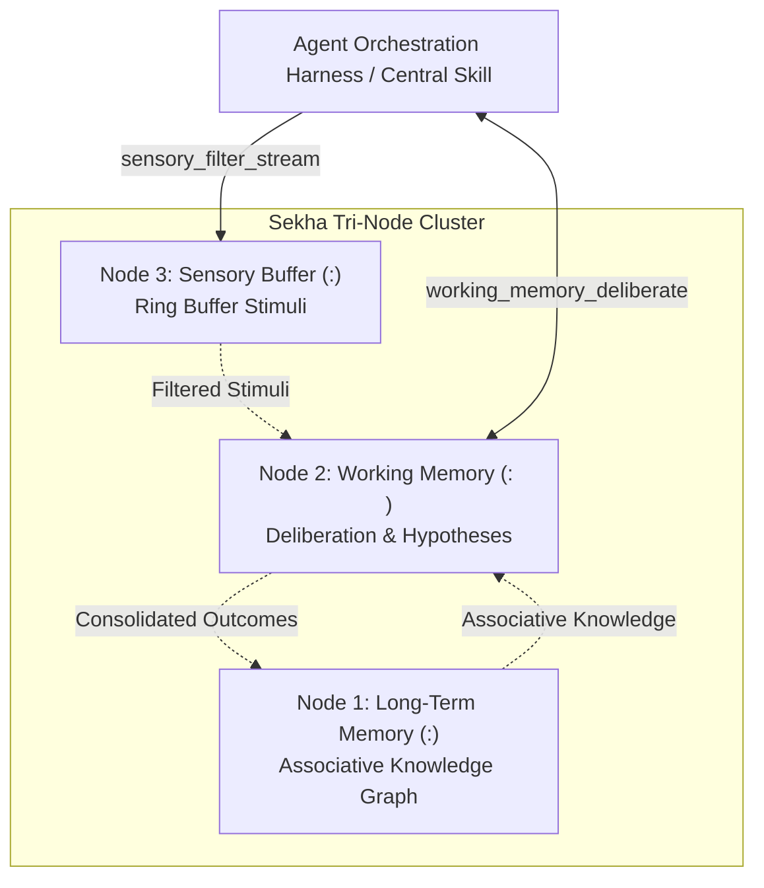

# 🧠 Sekha Working Memory Deliberation Scratchpad

[](LICENSE)
[]()
[]()

The **Working Memory Deliberation Scratchpad** is the active cognitive deliberation service for the **Sekha Tri-Node Edge Cognitive Cluster**.

It emulates human working memory by maintaining intermediate hypotheses, multi-step chain-of-thought trajectories, and uncommitted candidate actions in volatile local RAM **without prematurely polluting permanent storage**.

Deliberation prompt construction is **stateless and strictly isolated** to incoming request payloads, preventing in-memory state accumulation, token inflation, and context leakage across consecutive cognitive cycles. All host, port, model, and network parameters are fully decoupled and configurable via environment files.

---

## 🏛️ Place in the Tripartite Cognitive Cluster


```mermaid
graph TD
    Harness[Agent Orchestration Harness / Central Skill]
    
    subgraph Cluster["Sekha Tri-Node Cluster"]
        Node3["Node 3: Sensory Buffer (:<port>)<br>Ring Buffer Stimuli"]
        Node2["Node 2: Working Memory (:<port> )<br>Deliberation & Hypotheses"]
        Node1["Node 1: Long-Term Memory (:<port>)<br>Associative Knowledge Graph"]
    end
    
    Harness -->|"sensory_filter_stream"| Node3
    Node3 -.->|"Filtered Stimuli"| Node2
    Node1 -.->|"Associative Knowledge"| Node2
    Harness <-->|"working_memory_deliberate"| Node2
    Node2 -.->|"Consolidated Outcomes"| Node1
```

---

## ⚙️ Configuration & Environment

The service requires explicit configuration without hardcoded fallback values. Configuration is loaded from:
1. **CLI Flags** (e.g. `-node-port`, `-model`, `-inference-url`, `-env`)
2. **Environment Variables** (`os.Environ`)
3. **Local `.env` file** (or path provided via `-env`)
4. **System-wide configuration** at `/etc/default/sekha` (auto-discovered if `.env` is absent)

If any required configuration key is missing, the service fails fast with an explicit error.

### Required Environment Keys

| Variable | Description | Example |
| :--- | :--- | :--- |
| `NODE_PORT` | HTTP port for the deliberation scratchpad service (alias: `PORT`) | `8083` |
| `NODE_NAME` | Node identifier for cluster topology reporting | `sekha-node2` |
| `INFERENCE_URL` | Base URL of OpenAI-compatible inference engine (alias: `LLAMA_URL`) | `http://127.0.0.1:8082` |
| `INFERENCE_MODEL` | Model identifier (alias: `LLAMA_MODEL`) | `qwen2.5-1.5b-instruct` |
| `INFERENCE_TIMEOUT_SEC`| Timeout for one deliberation (inference call) in seconds; a full 4,096 window | `60` |
| `CONTEXT_LIMIT` | Maximum token envelope for cognitive context | `2048` |
| `OUTPUT_RESERVE` | Reserved tokens for next-step generation | `256` |
| `SYSTEM_PROMPT` | *(Optional)* System prompt override for deliberation reasoning | *(Custom string)* |

### Optional Prompt Budget Keys

Each part is a cap, not a reservation: whatever a part leaves unused goes to the sensory chunks.
The prompt window is `CONTEXT_LIMIT - OUTPUT_RESERVE`; packing targets that minus `PROMPT_SAFETY_MARGIN`.

| Variable | Description | Default |
| :--- | :--- | :--- |
| `GOAL_BUDGET` | Cap on the objective text | `150` |
| `OBSERVATION_BUDGET` | Cap on the current observation | `572` |
| `LONG_TERM_BUDGET` | Cap on long-term facts (ignored for `prepacked` requests) | `350` |
| `SENSORY_BUDGET` | Cap on sensory chunks; `0` = rest of the window (ignored for `prepacked` requests) | `0` |
| `PROMPT_SAFETY_MARGIN` | Headroom for chat-template tokens and token-estimate error | `32` |

### Example `.env`

Copy `.env.example` to `.env` to configure your environment:

```bash
cp .env.example .env
```

```env
# Server Configuration (Required)
NODE_PORT=<port>
NODE_NAME=<node name>

# Inference Engine Configuration (Required)
# Works with llama-server, vLLM, Ollama, or any OpenAI-compatible endpoint
INFERENCE_URL=http://127.0.0.1:<port>
INFERENCE_MODEL=<model> e.g qwen2.5-1.5b-instruct
INFERENCE_TIMEOUT_SEC=60

# Token Envelope & Memory Budget (Required)
CONTEXT_LIMIT=2048
OUTPUT_RESERVE=256

# Optional System Prompt Override
SYSTEM_PROMPT=
```

---

## ✨ Key Features

1. **Stateless Deliberation Isolation**:
   - Each deliberation cycle strictly constructs prompts from the incoming request payload (`objective`, `sensory_chunks`, `long_term_context`, `observation`).
   - Zero state leakage between consecutive tasks or distinct deliberation cycles.

2. **In-Memory Store & Snapshot Isolation**:
   - Operates in volatile RAM with zero disk overhead.
   - **Snapshot Checkpoints**: Capture working memory state before speculative actions.
   - **Instant Rollback**: If an intermediate hypothesis or tool proposal fails or is deemed unsafe, the scratchpad rolls back to an earlier snapshot, completely isolating errors.

3. **Dynamic Context Budgeter**:
   - Strictly enforces token boundaries (e.g., 2,048 tokens context with 256 tokens output reserve).
   - Caps Goal, Observation and Long-Term sections; Sensory gets the rest of the window.
   - When chunks must be dropped, the lowest-salience ones go first (at most one is truncated) and the kept chunks stay in their original order. Facts are dropped from the lowest-ranked end.
   - `prepacked: true` requests keep every chunk and fact if the rendered prompt fits the window.
   - UTF-8 rune-safe truncation prevents splitting multi-byte characters.

4. **Universal Inference Integration**:
   - Communicates with any OpenAI-compatible completions API (`/v1/chat/completions`).
   - Parses structured thoughts, discrete actions, and completion flags.
   - Supports per-request model overrides.

---

## 📡 REST API Reference

### 1. `POST /api/v1/working/deliberate`
Constructs a budget-constrained prompt from incoming stimuli and returns structured thoughts and discrete next actions.

**Request:**
```json
{
  "model": "qwen2.5-1.5b-instruct",
  "objective": "Diagnose inter-node packet loss between Node 3 and Node 2",
  "sensory_chunks": [
    {
      "id": "chunk-101",
      "text": "Ring buffer reported 2 dropped frames during 5000 req/s burst",
      "salience": 0.89,
      "source": "sekha-node3"
    }
  ],
  "long_term_context": [
    "Switch port 2 links to Node 3; full duplex flow control enabled"
  ],
  "observation": "Previous ping to 192.168.8.183 succeeded with 0.28ms latency",
  "max_tokens": 256,
  "temperature": 0.2,
  "prepacked": false,
  "prompt_budget_tokens": 0
}
```

**Response:**
```json
{
  "status": "ok",
  "step_index": 1,
  "thought": "Ping latency is optimal at 0.28ms, indicating physical link carrier is healthy. The reported drops were likely transient ICMP rate limits.",
  "proposed_action": "Query Node 3 sensory buffer stats endpoint for dropped count",
  "is_complete": false,
  "candidate_actions": [],
  "prompt_tokens": 142,
  "completion_tokens": 36,
  "total_tokens": 178,
  "prompt_eval_rate_tps": 32.15,
  "generation_rate_tps": 12.44,
  "active_goal": "Diagnose inter-node packet loss between Node 3 and Node 2",
  "trajectory_length": 1,
  "context_usage": {
    "sensory_received": 1,
    "sensory_kept": 1,
    "sensory_dropped": 0,
    "sensory_truncated": 0,
    "facts_received": 1,
    "facts_kept": 1,
    "estimated_prompt_tokens": 318,
    "actual_prompt_tokens": 142,
    "prompt_window_tokens": 1792
  },
  "timestamp": "2026-09-26T22:30:00Z"
}
```

`prepacked` (optional) says the caller already packed the chunks and facts to fit; `prompt_budget_tokens` (optional) is the budget it packed to. In `context_usage`, a truncated chunk counts as kept (`sensory_kept + sensory_dropped == sensory_received`), `estimated_prompt_tokens` is Node 2's estimate and `actual_prompt_tokens` is the inference server's count.

---

### 2. `POST /api/v1/working/snapshot`
Captures a snapshot of current working memory state for rollback isolation.

**Request:**
```json
{
  "description": "Pre-hypothesis checkpoint"
}
```

**Response:**
```json
{
  "status": "ok",
  "snapshot_id": 1,
  "description": "Pre-hypothesis checkpoint"
}
```

---

### 3. `POST /api/v1/working/rollback`
Restores working memory to a previous snapshot, discarding faulty or unsafe intermediate reasoning steps.

**Query Parameters:**
* `snapshot_id`: *(Optional)* ID of snapshot to restore. If omitted, reverts to the most recent snapshot.

**Response:**
```json
{
  "status": "rolled_back",
  "message": "working memory restored to snapshot",
  "state": {
    "session_id": "wm-a4f7819c4d2e",
    "active_goal": "",
    "sensory_context": [],
    "long_term_context": [],
    "trajectory": [],
    "candidate_actions": [],
    "status": "idle"
  }
}
```

---

### 4. `GET /api/v1/working/stats`
Returns cluster telemetry, active session counts, and memory envelope statistics.

**Response:**
```json
{
  "active_sessions": 1,
  "active_goal": "",
  "sensory_items_count": 0,
  "long_term_facts_count": 0,
  "trajectory_steps": 0,
  "candidate_actions": 0,
  "snapshot_count": 1,
  "est_context_tokens": 0,
  "uptime_seconds": 120,
  "last_updated": "2026-09-26T22:30:00Z"
}
```

---

### 5. `GET /api/v1/working/health` (or `/healthz`)
Reports daemon status, node identity, port, and validates downstream reachability to the inference engine.

**Response:**
```json
{
  "status": "healthy",
  "service": "sekha-working-scratchpad",
  "node": "sekha-node2",
  "port": 8083,
  "uptime_seconds": 120,
  "llama_inference": "reachable",
  "timestamp": "2026-09-26T22:30:00Z"
}
```

---

## 🛠️ Build & Installation

### Local Compilation
```bash
make build
```
Binaries are produced in `bin/`:
- `bin/sekha-working-scratchpad` (Daemon)
- `bin/sekha-scratchpad-validate` (Validation Suite)

### Cross-Compile for ARM64
```bash
make build-arm64
```

### Run Locally
Runs the daemon using settings loaded from `.env`:
```bash
make run
```
Or with custom flags/env overrides:
```bash
NODE_PORT=9090 INFERENCE_URL=http://localhost:8000 INFERENCE_MODEL=meta-llama/Llama-3.2-3B-Instruct go run ./cmd/server
```

### Run Validation Suite
Runs the synthetic multi-step verification test against a running service or spins up a local engine on the configured `NODE_PORT`:
```bash
make validate
```
Or test a custom port or remote target directly:
```bash
NODE_PORT=9090 make validate
# or
./bin/sekha-scratchpad-validate -url http://<node url>:<port>
```

---

## 🚀 System Deployment (`make install`)

The `install` target copies the compiled binary to `/usr/local/bin`, installs the active environment configuration to `/etc/default/sekha`, and registers the systemd unit:

```bash
# Install using the local .env configuration
sudo make install

# Or specify a custom environment file
ENV_FILE=/path/to/custom.env sudo make install
```

When installed:
- Environment configuration is stored at `/etc/default/sekha`.
- The binary can be executed from **any directory on the system** without missing its configuration:
  ```bash
  sekha-working-scratchpad
  ```
- The systemd unit (`sekha-working-scratchpad.service`) automatically loads `/etc/default/sekha` on boot.

Check daemon status:
```bash
sudo systemctl status sekha-working-scratchpad.service
```

Query the health endpoint:
```bash
curl http://localhost:<port>/api/v1/working/health
```

---

## 📄 License
Licensed under the Apache License, Version 2.0. See [LICENSE](LICENSE) for details.
